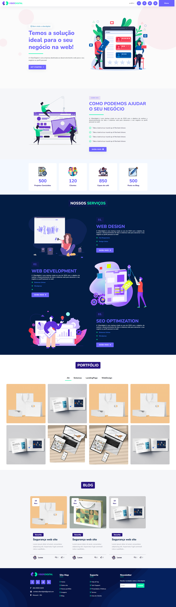

 

    

  <h3 align="center">Landing Page ViberDigital</h3>
  
  

     
        Design e código da Landing Page Desenvolvido por mim para meios de estudo

  

## Índice

- [Update](#update) - Ainda por fazer
- [Techs](#techs)
- [Cores](#cores)
- [Modelo](#modelo)
- [Tipo de fonte](#tipo-de-fonte)

# Update: (Ainda por fazer)

- Finalização da responsividade
- Adição de novos recursos no template
- Páginas secundárias 
- Página de Contato
- Envio de email 

# Techs:

- HTML
- CSS
- JS

## Cores:

    --color-branco: #fff;
    --color-branco-gelo: #fbfbfb;
    --color-azul-claro: #058bc0;
    --color-azul: #3f78e0;
    --color-laranja: #f2ae30;
    --color-azul-escuro: #031d44;
    --color-vermelho: #ff3369;
    --color-cinza: #e6e6e6;
    --color-bg: #F5F6F9;
    --color-roxo: #6C63FF;
    --color-preto: #070120;
    --color-verde: #0bf7ac;
    --color-roxo-escuro: #27137e;
    --color-gray: #868894;
    --shadow: 0 8px 40px -5px rgb(9 31 67 / 10%);

## Modelo:

O modelo da landing page foi desenvolvido por <a href="https://www.linkedin.com/in/lucasalexsandro/">Lucas Alexsandro</a>  
As imagens foram retiradas de alguns bancos de imagens disponíveis na web  

## Tipo de fonte:

  font-family: 'Nunito', sans-serif;
